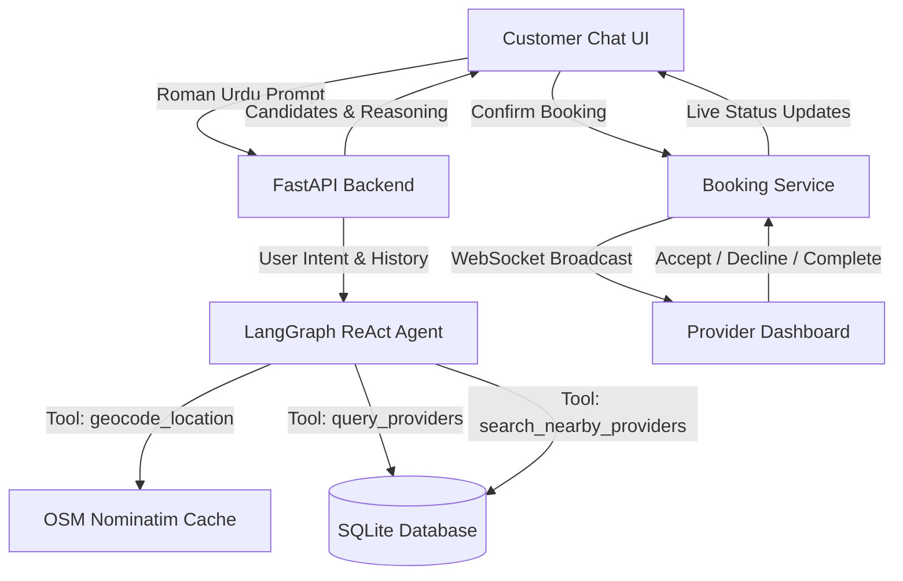

# Karigar.pk — Agentic Service Orchestrator

[](https://fastapi.tiangolo.com)
[](https://reactjs.org/)
[](https://langchain.com)
[](https://groq.com)
[](https://sqlite.org)

**Karigar.pk** is an AI-powered, agentic home services marketplace tailored for Pakistan (specifically Islamabad sectors). Customers can request services like electricians, plumbers, and AC technicians in conversational **Roman Urdu**. An intelligent **ReAct Agent** (powered by LangGraph and Groq) resolves locations, finds and ranks qualified providers by proximity, coordinates real-time dispatching, and handles the complete two-phase booking lifecycle with live status tracking via WebSockets.

---

## 📑 Table of Contents
- [Architecture & System Overview](#-architecture--system-overview)
- [Key Features](#-key-features)
- [Tech Stack](#-tech-stack)
- [Project Structure](#-project-structure)
- [Getting Started](#-getting-started)
  - [Prerequisites](#prerequisites)
  - [Backend Setup](#backend-setup)
  - [Frontend Setup](#frontend-setup)
- [API Endpoints Overview](#-api-endpoints-overview)
- [Agentic Workflow & Booking Flow](#-agentic-workflow--booking-flow)
- [Upcoming Roadmap](#-upcoming-roadmap)

---

## 🏛 Architecture & System Overview



---

## ✨ Key Features

### 1. 🤖 Conversational Roman Urdu ReAct Agent
* Natural Language Understanding (NLU) designed specifically for Roman Urdu (e.g. *"G-13 mein bijli wala bhejo"*, *"H-13 mein plumber chahiye"*).
* Dynamic reasoning loop via LangGraph with deterministic safety guards against hallucinations.
* Intelligent fallback to city-wide nearby providers when a specific sector has no available technicians.

### 2. ⚡ Real-Time Two-Phase Booking Lifecycle
* **Phase 1 (Discovery & Approval)**: AI agent selects candidate providers $\rightarrow$ user approves candidates from interactive candidate cards with rating, distance, and past reviews.
* **Phase 2 (Confirmation & Dispatch)**: Address and notes submission $\rightarrow$ dispatching $\rightarrow$ live WebSocket state machine (`Pending_Acceptance` $\rightarrow$ `In_Progress` $\rightarrow$ `Pending_Completion` $\rightarrow$ `Completed` / `Cancelled`).

### 3. 🛡 Robust Provider Decline & Cancellation Recovery
* If a provider declines or cancels, the customer is seamlessly redirected to the ongoing chat.
* The declined provider is automatically excluded, and the agent auto-triggers a background search for alternative candidates without repeating duplicate user prompts.
* Past candidate cards are permanently locked (`Unavailable`) to prevent duplicate bookings or expired session errors.

### 4. 📊 Comprehensive Provider Dashboard
* **Real-Time Job Management**: Active jobs, job completion requests, and decline tracking.
* **Audio-Visual Notifications**: Real-time WebSocket audio ping when a new job arrives.
* **Public & Authenticated Reviews**: Verified ratings and text reviews.
* **URL-Backed Pagination**: 10 records per page across Recent Bookings, Active Jobs, Job History, Declined Jobs, and Customer Reviews with state persistence across page reloads.

---

## 🛠 Tech Stack

### Backend
- **Framework**: [FastAPI](https://fastapi.tiangolo.com/) (Python 3.11+)
- **LLM Engine**: [LangGraph](https://github.com/langchain-ai/langgraph) + [Groq](https://groq.com) (`llama-3.3-70b-versatile`)
- **Database & ORM**: SQLite (`providers.db`) with [SQLAlchemy](https://www.sqlalchemy.org/)
- **Schemas & Validation**: [Pydantic v2](https://docs.pydantic.dev/)
- **Security & Auth**: JWT Tokens, OAuth2 password bearer, Passlib (bcrypt)
- **Real-Time Communication**: Native WebSockets with connection managers

### Frontend
- **Framework**: [React 18](https://reactjs.org/) + [Vite](https://vitejs.dev/)
- **Routing**: [React Router v6](https://reactrouter.com/)
- **Styling**: Vanilla CSS Design System with CSS Modules (Dark theme, glassmorphism, responsive)
- **Audio Engine**: Web Audio API for custom synthesized notification pings

---

## 📂 Project Structure

```
service-orchestrator/
├── backend/
│   ├── app/
│   │   ├── api/v1/routes/      # API Route Handlers (auth, booking, chat, provider, stats)
│   │   ├── core/               # Configuration & Security settings
│   │   ├── models/             # SQLAlchemy ORM Models
│   │   ├── schemas/            # Pydantic Schemas
│   │   ├── services/           # ReAct loop, tools, websockets, confirmation, auth
│   │   └── system_prompt/      # Agent system prompt & decision trees
│   ├── tests/                  # Automated unit and integration tests
│   ├── requirements.txt        # Python dependencies
│   └── run.py                  # Backend startup script
├── frontend/
│   ├── src/
│   │   ├── api/                # API client layer (auth, booking, chat, provider)
│   │   ├── components/
│   │   │   ├── auth/           # Login / Register modals
│   │   │   ├── booking/        # Candidate grid, modals, receipt
│   │   │   ├── chat/           # Chat window, message bubbles, provider cards
│   │   │   ├── landing/        # Hero, services, stats sections
│   │   │   ├── layout/         # Sidebar, headers
│   │   │   ├── provider/       # Provider dashboard tabs & job cards
│   │   │   └── ui/             # Reusable UI (Badge, Button, EmptyState, Input, Pagination, Toast)
│   │   ├── context/            # React Contexts (Auth, Chat, Toast, ProviderStats)
│   │   ├── hooks/              # Custom hooks (useBooking, useChatSync)
│   │   ├── pages/              # LandingPage, ChatPage, ConfirmedPage, ProviderDashboardPage
│   │   └── styles/             # Global CSS design tokens
│   ├── package.json            # Frontend dependencies & scripts
│   └── vite.config.js          # Vite bundler configuration
└── providers.db                # SQLite database
```

---

## 🚀 Getting Started

### Prerequisites
- **Python 3.11+**
- **Node.js 18+** & **npm**
- **Groq API Key** (for agent ReAct loop)

---

### Backend Setup

1. **Navigate to the backend directory**:
   ```bash
   cd backend
   ```

2. **Create and activate a virtual environment**:
   ```bash
   # Windows (PowerShell)
   python -m venv venv
   .\venv\Scripts\Activate.ps1

   # macOS / Linux
   python3 -m venv venv
   source venv/bin/activate
   ```

3. **Install dependencies**:
   ```bash
   pip install -r requirements.txt
   ```

4. **Environment Variables**:
   Create a `.env` file in `backend/` with:
   ```env
   GROQ_API_KEY=your_groq_api_key_here
   SECRET_KEY=your_jwt_secret_key_here
   ALGORITHM=HS256
   ACCESS_TOKEN_EXPIRE_MINUTES=1440
   ```

5. **Start the backend server**:
   ```bash
   python run.py
   ```
   *The API will start at `http://localhost:8000` (Interactive Swagger Docs: `http://localhost:8000/docs`).*

---

### Frontend Setup

1. **Navigate to the frontend directory**:
   ```bash
   cd frontend
   ```

2. **Install npm packages**:
   ```bash
   npm install
   ```

3. **Start the Vite development server**:
   ```bash
   npm run dev
   ```
   *The application will be accessible at `http://localhost:5173`.*

---

## 📡 API Endpoints Overview

| Method | Endpoint | Description | Access |
|---|---|---|---|
| `POST` | `/api/v1/auth/login` | Authenticate customer or provider | Public |
| `POST` | `/api/v1/auth/register` | Register new user or provider | Public |
| `POST` | `/api/v1/chat/book` | Send prompt to ReAct Agent (Phase 1) | Customer |
| `POST` | `/api/v1/chat/confirm` | Confirm booking with approved IDs (Phase 2) | Customer |
| `GET` | `/api/v1/chat/conversations` | Get user's conversation history | Customer |
| `POST` | `/api/v1/chat/{id}/sync` | Sync message state to DB | Customer |
| `GET` | `/api/v1/providers/{id}/jobs` | Get assigned jobs for provider | Provider |
| `PUT` | `/api/v1/providers/{id}/jobs/{sid}/status` | Accept/Decline/Complete job | Provider |
| `GET` | `/api/v1/providers/{id}/reviews` | Paginated provider reviews | Public |
| `WS` | `/ws/job/{session_id}` | Real-time customer tracking WebSocket | Authenticated |
| `WS` | `/ws/provider/{provider_id}` | Real-time provider job dispatch WebSocket | Provider |

---

## 🗺 Upcoming Roadmap

- [ ] **Direct Phone Call Link**: Instant one-click phone dialer button connecting customer with assigned provider upon acceptance.
- [ ] **Interactive Live Map**: Real-time routing map showing technician's location and live ETA to the customer's doorstep.
- [ ] **Multi-City Expansion**: Expanding geocoding and provider networks to Rawalpindi, Lahore, and Karachi.

---

## 📄 License
This project is proprietary and confidential. Developed for Karigar.pk.
